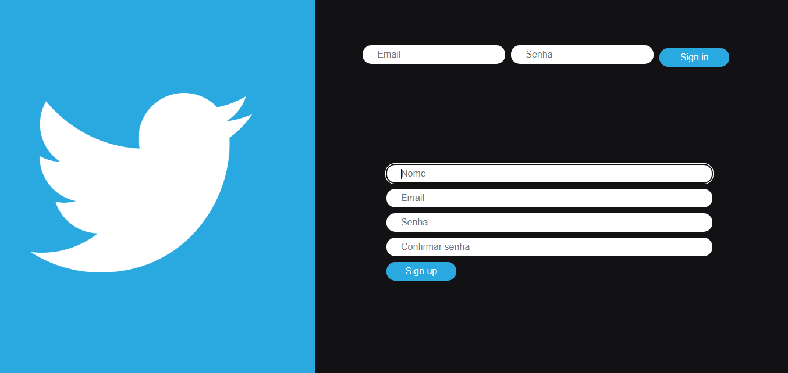

<h1 align="center">Clone Twitter com React</h1>

## Descrição
Primeiro projeto feito em React e utilizando uma API.

#

<div>
    
</div>

#

# Layout
<div align="center">

</div>


#
# Pré-requisitos

Antes de começar, você vai precisar ter instalado em sua máquina as seguintes ferramentas:
[Git](https://git-scm.com), [Node.js](https://nodejs.org/en/). 
Além disto é bom ter um editor para trabalhar com o código como [VSCode](https://code.visualstudio.com/)

# Rodando o projeto

```bash
# Clone este repositório
$ git clone 

# Execute o projeto
$ npm start
```